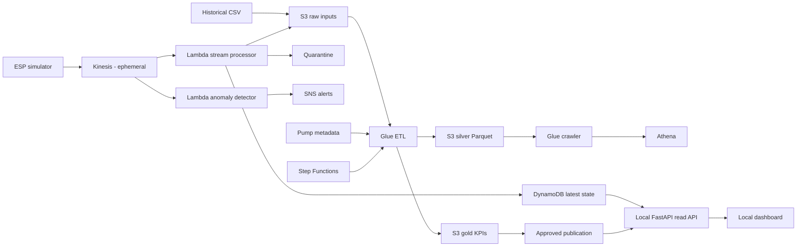
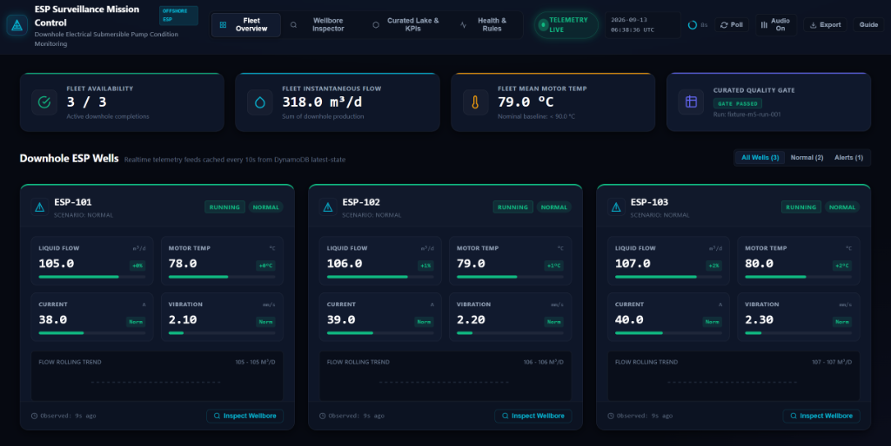
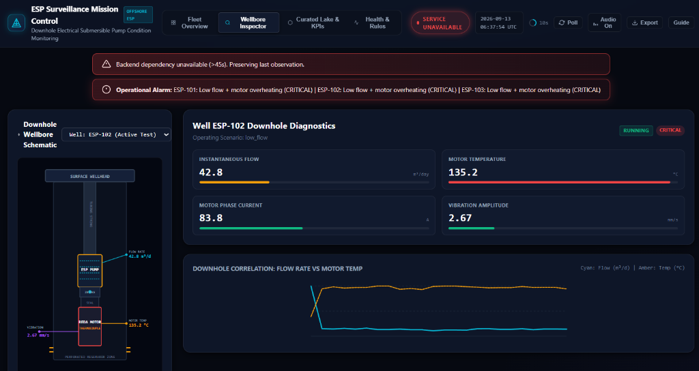
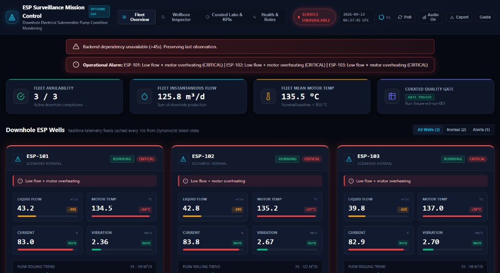

# Offshore ESP Data Platform

[](https://github.com/xuanquangIT/aws-oilfield-esp/actions/workflows/validate.yml)
[](LICENSE)
[](https://www.python.org/downloads/)
[](https://aws.amazon.com/cdk/)
[](PROJECT-STATUS.md)
[](docs/05-COST-AND-SECURITY.md)

A cost-aware, evidence-driven AWS data platform for **synthetic offshore Electric Submersible Pump (ESP) telemetry**. The project combines bounded realtime surveillance with reproducible batch analytics, data-quality gates, operational recovery, and a local customer-facing dashboard.

> This repository is designed as a realistic cloud data engineering reference project. It uses synthetic telemetry and simplified anomaly rules; it is **not** an industrial control system and does not claim equipment diagnostic accuracy.

## Why this project exists

Oilfield telemetry systems need to answer two different questions well:

1. **What needs attention now?** — recent pump state, anomalies, and operational signals.
2. **What happened over time?** — reconciled historical telemetry, daily KPIs, and queryable analytical data.

This project demonstrates how those two paths can share one governed data contract while remaining cost-conscious and reproducible in a sandbox AWS account.

## Architecture

The platform connects real-time downhole telemetry streaming with scheduled batch processing, storing raw evidence in an S3 Data Lake, cataloging canonical datasets, running serverless analytics with Athena, and serving a live mission-control dashboard.




The persistent **core stack** owns storage, DynamoDB, Lambda functions, Glue, Athena, Step Functions, budget controls, and supporting resources. The **realtime stack** owns the temporary Kinesis stream and event-source mappings so realtime infrastructure can be created for a demo and removed afterward.

For the detailed architecture, trade-offs, and ADRs, see [docs/02-ARCHITECTURE.md](docs/02-ARCHITECTURE.md).

## Current implementation status

The project tracks implementation separately from acceptance evidence so planned capabilities are never presented as complete.

| Area | Current state |
|---|---|
| Data contract and quarantine | Implemented and AWS-verified |
| Realtime latest-state correctness | Implemented and AWS-verified with monotonic DynamoDB writes |
| Alert cooldown / recovery state | Implemented and AWS-verified |
| Batch reconciliation and publication | Implemented and AWS-verified with deterministic reruns and immutable outputs |
| Step Functions orchestration | Implemented and AWS-verified |
| Recovery / export / restore drills | Implemented and AWS-verified |
| Local FastAPI + dashboard | Implemented; AWS-mode smoke tested |
| Final M5 customer rehearsal gates | Still open |

See [PROJECT-STATUS.md](PROJECT-STATUS.md) for the implementation ledger and evidence details.

## Key capabilities

- **Realtime ingestion** with a bounded, disposable one-shard Kinesis stream.
- **Schema validation and quarantine** for invalid telemetry.
- **Idempotent raw history** keyed by stable event identity.
- **Monotonic latest state** in DynamoDB so late or duplicate events cannot regress current state.
- **Anomaly detection** with deterministic alert IDs, cooldown, and recovery state.
- **Mixed-source batch processing** across historical CSV and archived realtime JSON.
- **Manifest-driven Glue ETL** with SHA-256-bound inputs and reproducible runs.
- **Immutable silver/gold outputs** plus an approved publication pointer.
- **Athena analytics** over curated Parquet with partition-pruning evidence.
- **Local FastAPI dashboard backend** reading real DynamoDB state and approved KPI data.
- **Infrastructure as Code** with AWS CDK.
- **Cost-aware lifecycle controls** for deploy, demo, park, export, restore, and destroy workflows.
- **Offline CI validation** without requiring AWS credentials.

## Surveillance Mission Control Dashboard

The required consumer experience runs locally and adds no dedicated always-on dashboard infrastructure.

The dashboard backend:
- binds to loopback by default (`127.0.0.1:8765`);
- uses the operator's normal AWS credential chain server-side;
- never sends AWS credentials to browser code;
- reads latest ESP state from DynamoDB;
- reads approved KPI publication data from S3;
- caches reads to avoid unnecessary AWS requests.

### Live Fleet Overview
Observes real-time telemetry feeds polled from DynamoDB, calculates fleet-level availability and aggregate flow, and displays rolling trend curves for active wells.



### Wellbore Inspector & Physical Diagnostics
Deep-dive inspection view for individual wells featuring a downhole completion schematic, REDA motor thermocouple readings, intake flow rates, and dynamic flow-vs-temperature correlation charts.



### Operational Alarms & Fault Detection
Real-time anomaly detection with alert episode tracking and cooldown logic. Alerts surface instantly in the UI with severity ratings when critical thresholds are exceeded (e.g. low flow + motor overheating).



See [docs/07-DEMO-AND-DASHBOARD.md](docs/07-DEMO-AND-DASHBOARD.md) for dashboard modes, rehearsal criteria, and customer-demo guidance.

## Quick start

### Prerequisites

- Python **3.12**
- Node.js **24**
- npm
- PowerShell
- AWS CLI v2 for cloud workflows
- An AWS sandbox account/profile for deployment scenarios

### Local validation

Local validation does **not** require AWS credentials or deployment.

```powershell
git clone https://github.com/xuanquangIT/aws-oilfield-esp.git
cd aws-oilfield-esp

py -3.12 -m venv .venv
.\.venv\Scripts\python.exe -m pip install -r requirements-lock.txt
npm ci

.\scripts\validate.ps1
```

The validation workflow runs tests, checks documentation links, and synthesizes the CDK application without deploying resources.

For full setup instructions, see [docs/01-GETTING-STARTED.md](docs/01-GETTING-STARTED.md).

### Local Dashboard Preview (Fixture Mode)

Test and explore the surveillance mission control frontend locally with synthetic fault scenarios:

```powershell
# Launch normal operating conditions
.\scripts\dashboard.ps1 -Mode fixture -FixtureState normal

# Simulate low flow & motor overheating critical alarm
.\scripts\dashboard.ps1 -Mode fixture -FixtureState low_flow
```
Open [http://127.0.0.1:8765](http://127.0.0.1:8765) in your browser.

## Running the AWS demo

> AWS deployment can incur charges. Use a dedicated sandbox account/profile and verify the selected account and region before creating resources.

Configure your shell:

```powershell
$env:AWS_PROFILE = 'your-sandbox-profile'
$env:AWS_DEFAULT_REGION = 'us-east-1'
$env:AWS_REGION = $env:AWS_DEFAULT_REGION

aws sso login --profile $env:AWS_PROFILE
aws sts get-caller-identity
```

Deploy the persistent core:

```powershell
.\scripts\deploy-core.ps1 -BudgetEmail 'your-real-email-address'
```

Run a bounded realtime scenario:

```powershell
.\scripts\realtime-start.ps1 -DurationMinutes 5 -Scenario normal
```

Run the batch flow:

```powershell
.\.venv\Scripts\python.exe scripts/seed-batch-data.py
.\scripts\upload-batch.ps1
.\scripts\run-batch.ps1
```

Use the complete operational sequence in [docs/09-RUNBOOK.md](docs/09-RUNBOOK.md) when performing AWS acceptance or recovery drills.

## Cost model

Near-zero idle spend is a design objective, not a guarantee of a zero AWS bill.

The repository intentionally separates persistent core resources from disposable realtime infrastructure. Kinesis is created only for bounded demos, ETL is not scheduled continuously, and lifecycle scripts explicitly park or destroy temporary resources.

Current modeled examples are documented in [docs/05-COST-AND-SECURITY.md](docs/05-COST-AND-SECURITY.md). Always replace modeled estimates with measured billing evidence for your own account, region, usage pattern, and AWS pricing period.

## Repository structure

```text
.github/workflows/    offline CI validation
dashboard/            local FastAPI API and browser dashboard
data/                 generated synthetic input
docs/                 architecture, operations, cost, demo and learning guides
evidence/             validation reports and cloud evidence records
infrastructure/       AWS CDK stacks
scripts/              deployment, lifecycle, recovery and validation commands
simulator/            synthetic ESP realtime producer
sql/                  Athena queries
src/                  stream processing, anomaly detection and Glue code
tests/                offline behavioral and infrastructure tests
```

## Documentation

| Topic | Document |
|---|---|
| Documentation hub | [docs/00-START-HERE.md](docs/00-START-HERE.md) |
| Setup and deployment | [docs/01-GETTING-STARTED.md](docs/01-GETTING-STARTED.md) |
| Architecture | [docs/02-ARCHITECTURE.md](docs/02-ARCHITECTURE.md) |
| Data domain and contract | [docs/03-DATA-DOMAIN-AND-CONTRACT.md](docs/03-DATA-DOMAIN-AND-CONTRACT.md) |
| Operations | [docs/04-OPERATIONS.md](docs/04-OPERATIONS.md) |
| Cost, security and governance | [docs/05-COST-AND-SECURITY.md](docs/05-COST-AND-SECURITY.md) |
| Delivery and acceptance | [docs/06-DELIVERY-AND-LEARNING.md](docs/06-DELIVERY-AND-LEARNING.md) |
| Dashboard and demo | [docs/07-DEMO-AND-DASHBOARD.md](docs/07-DEMO-AND-DASHBOARD.md) |
| Sources | [docs/08-SOURCES.md](docs/08-SOURCES.md) |
| Operational runbook | [docs/09-RUNBOOK.md](docs/09-RUNBOOK.md) |
| Implementation ledger | [PROJECT-STATUS.md](PROJECT-STATUS.md) |
| Change history | [CHANGELOG.md](CHANGELOG.md) |

## Contributing

Contributions are welcome! Before opening a pull request:

1. Read [PROJECT-STATUS.md](PROJECT-STATUS.md) and [CONTRIBUTING.md](CONTRIBUTING.md).
2. Adhere to the [Code of Conduct](CODE_OF_CONDUCT.md).
3. Install the locked dependencies.
4. Run `scripts/validate.ps1` locally.
5. Add failure/recovery tests for behavioral changes where meaningful.
6. For new AWS resources, document ownership, lifecycle, permissions, cost impact, and teardown behavior.
7. Keep documentation and implementation status synchronized with code changes.

Please do not commit credentials, generated customer-like data, account identifiers, or secrets.

## Security and responsible use

This repository is intended for sandbox experimentation, learning, portfolio demonstration, and architecture discussion.

- Telemetry is synthetic.
- Rules are simplified examples.
- The system is not intended for safety-critical or production equipment control.
- Deployments should use least-privilege sandbox credentials and explicit cost monitoring.
- Review [docs/05-COST-AND-SECURITY.md](docs/05-COST-AND-SECURITY.md) and [SECURITY.md](SECURITY.md) before cloud deployment.

## Roadmap

The immediate release goal is to close the remaining M5 consumer-experience acceptance gates, including repeated live rehearsals, stale/error behavior, clean-machine recreation, freshness/cache measurements, and customer-facing evidence.

Longer-term extensions may explore hosted dashboards, larger-scale streaming, buffered writes, stronger IAM boundaries, observability, and production-grade disaster recovery. These are extensions, not claims about the current baseline.

## License

This project is licensed under the [MIT License](LICENSE) - see the [LICENSE](LICENSE) file for details.

---

Built to make AWS data engineering trade-offs visible, testable, reproducible, and explainable.
