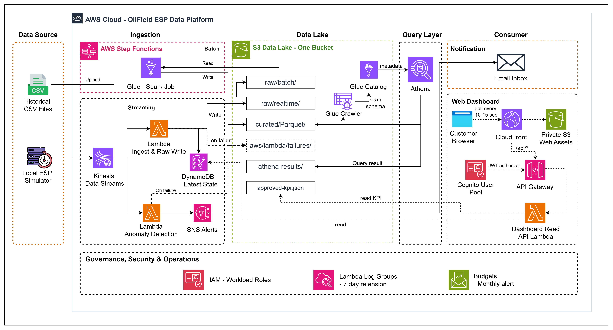
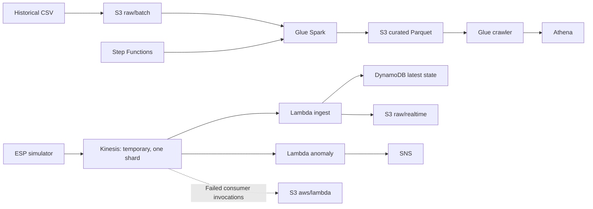
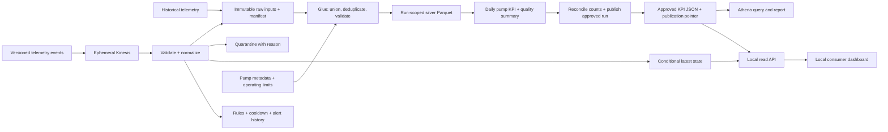
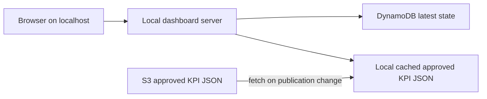

# Architecture

## Product question

Which synthetic ESPs need attention now, and how do their historical flow, temperature and oil-rate trends compare? A credible demonstration must trace one event from producer to operational state and into reconciled analytical output.

## Current implementation

The PowerShell batch wrapper waits for Step Functions, then runs the crawler. The deployed state machine currently contains only the Glue job. Batch does not read raw/realtime. The two lanes therefore share a business domain and storage bucket but are not yet one reconciled analytical pipeline.

Core owns storage, application Lambdas, catalog, Glue job/crawler, workgroup, workflow, disabled schedule and budget. Realtime owns Kinesis, mappings and the policies that grant stream reads. It references core outputs; core never references realtime. Core must exist before exclusive realtime deployment.

## Committed Phase 1 implementation scope: M1-M5

The raw layer preserves evidence; silver provides canonical typed events; gold answers business questions. The approved publication is the analytical contract consumed by Athena and the dashboard, while DynamoDB latest state supplies the operational view. No warehouse is required. This end-to-end flow is committed Phase 1 scope; its implementation and AWS evidence remain open.

## Phase 1 local web dashboard: required consumer layer

The default dashboard runs only on the operator's laptop during a demo. It is the required consumer layer for this project and adds no deployed AWS resource or fixed monthly dashboard charge. A loopback-only local API uses the operator's existing AWS credential chain; credentials never enter browser code.

The browser polls the local API every 10–15 seconds. The server uses one batched read for the known ESP IDs and caches the result for the polling interval. It fetches approved KPI JSON from S3 only when its published run/version changes or the operator requests a refresh. It never queries Athena per browser refresh, scans DynamoDB, exposes AWS credentials, or listens on a non-loopback interface by default.

This mode can still create small usage-based DynamoDB and S3 request charges; the project promises no new fixed dashboard cost, not a guaranteed $0 AWS bill. The local process stops after the demo while the existing parked-core policy remains unchanged.

## Optional hosted dashboard profile: outside the required idle baseline

For a time-limited customer link, an optional stack can use CloudFront, a separate private S3 web-assets bucket with Origin Access Control, API Gateway HTTP API, Cognito JWT authorization and a read-only Dashboard Lambda. This stack is deployed only on request, measured and destroyed afterward. It reuses the existing DynamoDB table and approved KPI object rather than creating duplicate data stores. Details and release gates are in [demo and dashboard](07-DEMO-AND-DASHBOARD.md).

## Reliability decisions

| Concern | Target behavior | Current limitation |
|---|---|---|
| Delivery | At-least-once, explicit event identity and duplicate accounting | Consumers can repeat side effects |
| Event time | Keep every valid event in history; condition latest-state writes by event time | Unconditional puts can move latest state backward |
| Invalid input | Quarantine payload, reason, version and source reference | Failure destination captures failed batches after retry; no semantic quarantine |
| Replay | Reuse event_id, suppress duplicate effects, label replay run | Manual payload retrieval only |
| Alerting | Deterministic alert identity, cooldown, recovered state | One SNS publish per anomalous observation |
| Batch rerun | Immutable output per run; publish after checks; retain prior success | Whole curated prefix overwritten |
| Late data | Recompute affected UTC dates, including defined lookback | No incremental handling |
| Schema | Additive optional changes; incompatible versions isolated | Independent CSV/JSON schemas |
| Failover | Document loss window and restore source | No cross-region deployment or production DR |

S3 failure destinations retain payloads for investigation; they do not create a replay tool or guarantee successful delivery to the destination. Monitor destination failures too. [AWS failure destination behavior](https://docs.aws.amazon.com/lambda/latest/dg/kinesis-on-failure-destination.html).

## Scale and alternatives

Default simulator load is three records per tick at roughly one tick/second. One shard and shared-throughput consumers suit this small demo; measure actual latency before setting expectations. Per-event S3 writes are easy to trace but create small files and request overhead.

For sustained ingestion, evaluate buffered writes or Firehose, then compaction. For stateful windows and watermarks, evaluate Flink. For high-concurrency warehouse consumers, evaluate Redshift. For industrial integration, evaluate IoT services and domain-specific access requirements. These are architecture exercises or temporary extension labs, not always-on baseline resources.

See [architecture decisions](adr/README.md), [data domain and contract](03-DATA-DOMAIN-AND-CONTRACT.md), and [delivery and learning](06-DELIVERY-AND-LEARNING.md).
