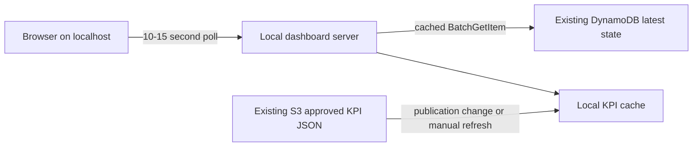
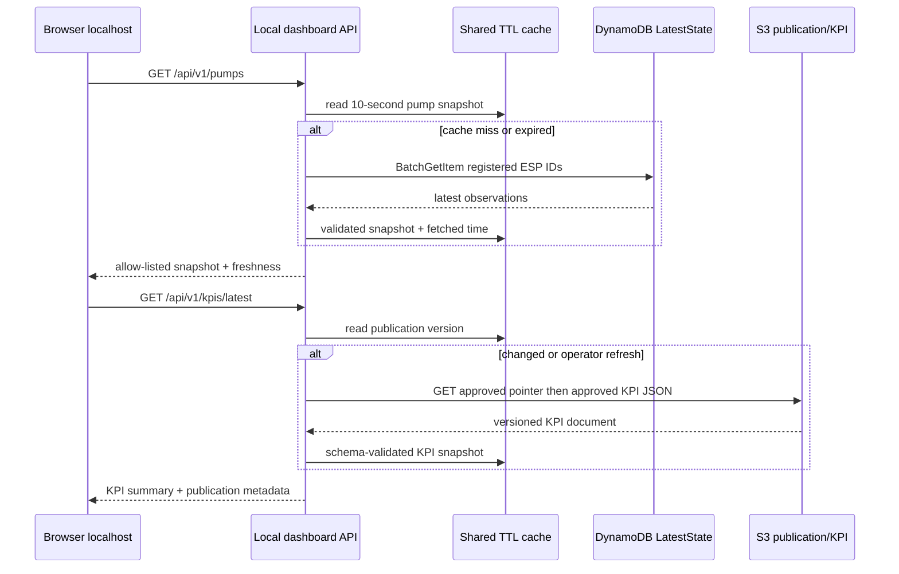

# Demo, dashboard and customer package

This document defines the required local dashboard, optional hosted profile, customer narrative and rehearsal. The local dashboard is the required consumer layer in the committed Phase 1 flow; its implementation and evidence are still open.

## Phase 1 realtime web dashboard

Status: **required Phase 1 consumer deliverable; implementation and evidence not yet complete.** Phase 1 cannot be called a complete customer product until the dashboard consumes real latest state and approved KPIs, then passes G10. The default profile is local-first so it introduces no new fixed monthly AWS service charge.

Backend foundation is implemented and offline-tested: `dashboard/server.py` binds only `127.0.0.1:8765`, offers the four versioned read-only endpoints, provides deterministic fixture modes, shared freshness cache and AWS read adapters. Start the fixture API without AWS access:

```powershell
.\scripts\dashboard.ps1 -Mode fixture -FixtureState normal
```

Use `-Mode aws` only after M3 publishes a `kpi_summary` into the approved publication pointer; the existing pointer supplies real run/quality metadata but intentionally does not fabricate Parquet KPI rows. Browser UI, live integration and G10 rehearsal evidence remain open.

**AWS integration verified on 2026-09-13.** Core update published the M3 `publication_version: 2` pointer and immutable `dashboard-kpi-summary.v1` artifact. A Step Functions publication completed after Glue and a fresh crawler gate. A short loopback AWS-mode smoke test served the UI root with HTTP 200, returned three `fresh` DynamoDB pump cards and six KPI rows from the approved publication. This is integration evidence, not the two full rehearsals or the 60-minute G10 measurement.

### Product boundary

The dashboard gives an operator or customer a browser view of synthetic ESP health without requiring AWS Console access. It has two read models:

| View | Source | Refresh behavior |
|---|---|---|
| Live pump cards | Existing DynamoDB latest-state table via local API | Browser poll every 10–15 seconds; one shared server cache |
| Daily KPI and quality | Approved KPI JSON fetched from existing S3 data lake | Fetch only when publication ID changes or on explicit refresh |

“Realtime” means near-real-time observation of the latest state after a successful poll. It does not imply browser access to Kinesis, push delivery, zero latency or operational control. The page always shows `Synthetic data`, `Local demo`, `Last refreshed`, `Data age`, and the published batch run ID.

### Required Phase 1 architecture: local profile



The dashboard server runs from the repository and binds to `127.0.0.1` by default. It uses the operator's selected AWS profile/region through the server-side SDK credential chain. No credential, signed request capability, table name, bucket name or AWS Console link is embedded in frontend code.

The server reads the three known ESP keys with a batched operation and caches the response for the configured polling interval. Multiple browser tabs share the server cache. The server must not scan the table. KPI JSON is downloaded once per published version, validated and cached locally. Athena is not called from the browser or polling loop.

Stopping the local process removes the dashboard runtime. No CloudFront distribution, API Gateway, Cognito pool, dashboard Lambda, container, VM or web-assets bucket exists in the required profile.

### M5 implementation blueprint (approved before coding)

Use a FastAPI ASGI backend following a ports-and-adapters structure and a static single-page application supplied separately. The server owns AWS SDK calls; the browser has no AWS SDK, profile, signed request, physical resource name or configuration file. This is deliberately not a hosted service and does not change the CDK stacks.

| Component | Location | Responsibility | Must not do |
|---|---|---|---|
| ASGI composition root | `dashboard/app/main.py` | Create the FastAPI app, compose dependencies and apply security headers | Contain route or AWS logic |
| HTTP presentation | `dashboard/app/presentation/` | Versioned Pydantic DTOs, routers and safe HTTP errors | Access AWS clients or cache values directly |
| Application service | `dashboard/app/application/` | Orchestrate repository reads and thread-safe cache/freshness rules | Depend on FastAPI or boto3 |
| Domain port/models | `dashboard/app/domain/` | Provider-agnostic dashboard models and repository protocol | Know credentials, HTTP or CloudFormation |
| Infrastructure adapters | `dashboard/app/infrastructure/` | Deterministic fixtures and the read-only DynamoDB/S3/CloudFormation adapter | Scan DynamoDB, run Athena or read raw/quarantine data |
| Browser assets | `dashboard/static/` | Responsive cards, KPI panel, accessibility labels and explicit loading/stale/unavailable states | Contain secrets, AWS SDK code or operational controls |
| Launcher | `scripts/dashboard.ps1` | Validate selected profile/region, start loopback process and print the local URL | Deploy, destroy or mutate AWS resources |

The backend pins FastAPI, Uvicorn and HTTPX in the requirements and lockfile. It exposes no OpenAPI/docs endpoint in the local demo profile, applies no-store/nosniff/frame/referrer headers, and defaults to `127.0.0.1:8765`; a non-loopback bind is rejected by configuration rather than left as a convenience switch.

#### Read and cache sequence



Cache entries carry `fetched_at`, source version and last successful payload. A failed refresh returns the last successful payload only with `state: "stale"`; after 45 seconds without a successful refresh it returns `state: "unavailable"` with no fabricated measurements. The health endpoint exposes only aggregate counters and ages: cache hits/misses, last successful DynamoDB/S3 refresh, dependency state and app version.

#### Stable response envelope

Every data endpoint returns a versioned envelope so the UI can evolve without exposing provider objects:

```json
{
  "schema_version": "dashboard.v1",
  "state": "fresh",
  "fetched_at": "2026-09-13T04:00:00Z",
  "data_age_seconds": 4,
  "data": []
}
```

`state` is exactly `fresh`, `stale`, or `unavailable`. `/pumps` carries a list of the existing allow-listed pump fields; `/kpis/latest` carries the approved run ID, publication time, quality decision and allow-listed aggregate KPI fields. The server validates DynamoDB attribute types and KPI JSON before populating a cache. A malformed source is an unavailable dependency, never a partially guessed response.

#### Build and test order

1. Add fixture provider, response schema and unit tests for allow-list, unknown pump rejection, state transitions and no-AWS fixture mode.
2. Add server routes/static shell and loopback-only integration tests; assert browser assets contain no credential-like strings, AWS SDK import or physical resource name.
3. Add DynamoDB batch-read adapter with injected fake client tests, then S3 publication adapter with schema/version tests.
4. Connect a real parked core for one normal and one low-flow bounded realtime run; capture API/UI freshness and stale/unavailable evidence.
5. Run the two rehearsal and 60-minute measurement gates before describing M5 as accepted.

### API contract

Expose these loopback-only, read-only endpoints:

| Endpoint | Response | Source |
|---|---|---|
| `GET /api/v1/pumps` | Allowed latest fields for all registered demo pumps | Cached DynamoDB batch read |
| `GET /api/v1/pumps/{esp_id}` | Allowed latest fields for one registered pump | Same cache |
| `GET /api/v1/kpis/latest` | Published daily KPI/quality summary and run metadata | Validated local KPI cache |
| `GET /api/v1/health` | App version, mode and dependency freshness only | Local process |

The response allow list is: `esp_id`, `timestamp`, `status`, `scenario`, `flow_rate`, `motor_temperature`, `motor_current`, `vibration`, `severity`, `finding`, `data_age_seconds`, `published_run_id`, and `published_at`. M2 must make numeric values typed and state updates monotonic before live release.

Reject unknown pump IDs, unsupported parameters and non-loopback access. Never return raw records, Kinesis sequence numbers, failure payloads, CloudFormation outputs, account identifiers, arbitrary S3 keys, arbitrary Athena SQL, environment variables, credentials or exception stacks.

### Frontend behavior

The responsive single page contains three pump cards, latest status/severity, signal values, observation time/data age, daily KPI trend, data-quality state and published run ID. Fixture mode enables offline UI development and deterministic screenshots before AWS integration.

Only one request can be in flight per browser. On an API failure, keep the last values with an explicit `stale` banner and last-success timestamp. After the configured stale threshold, show `unavailable`. Do not display stale values as live, infer missing samples as zero, or render unbounded raw-event charts.

### Cost controls

The required dashboard creates no new deployed AWS resource and no new fixed dashboard subscription. Incremental DynamoDB reads, S3 requests and transfer can still be billed; this is not a guaranteed $0 AWS bill.

Controls:

- One server cache shared by all local tabs; minimum poll interval 10 seconds.
- `BatchGetItem` for configured ESP IDs; no table scan.
- KPI fetch on publication version change or explicit refresh; no S3 LIST polling.
- No Athena query per refresh.
- No QuickSight, SPICE, WebSocket, custom dashboard metric, provisioned concurrency or always-on compute.
- Process runs only during a demo and exposes local health/counter evidence before stopping.

A 60-minute rehearsal records browser polls, cache hits/misses, DynamoDB operations/capacity, S3 GETs/bytes, API latency, end-to-end freshness and eventually available billing. An unavailable bill is recorded as unavailable, not zero.

### Optional hosted profile

An external customer URL is an optional delivery profile, not a separate data flow. When explicitly needed, deploy a separate stack containing CloudFront, a separate private S3 web-assets bucket with Origin Access Control, API Gateway HTTP API, Cognito JWT authorization and a read-only Dashboard Lambda. It reuses the existing latest-state table and approved KPI object.

The optional stack has independent deploy/destroy commands, permissions, evidence and cost accounting. It is excluded from the parked baseline and destroyed after the sharing window. CloudFront uses Origin Access Control so the web-assets bucket remains private. [CloudFront OAC guidance](https://docs.aws.amazon.com/AmazonCloudFront/latest/DeveloperGuide/GettingStarted.SimpleDistribution.html), [API Gateway pricing](https://aws.amazon.com/api-gateway/pricing/), [CloudFront pricing](https://aws.amazon.com/cloudfront/pricing/), [Cognito pricing](https://aws.amazon.com/cognito/pricing/).

### Delivery sequence

1. Alongside M1: build responsive UI shell, fixture mode and response schema.
2. After M2: connect local API to monotonic DynamoDB latest state and verify stale/error behavior.
3. After M3: publish and consume versioned approved KPI JSON.
4. After M4: complete permission, failure, cleanup and usage evidence.
5. M5: run two complete customer rehearsals and publish redacted screenshots/recording.

### G10 acceptance evidence

1. One command starts the server on `127.0.0.1`; one command/check stops it cleanly.
2. A non-loopback request is rejected and no AWS credential appears in browser assets or API responses.
3. The API returns only allow-listed fields and rejects unknown pump IDs/parameters.
4. Normal and low-flow scenarios appear within the measured freshness target.
5. Forced DynamoDB/S3 failures show stale then unavailable state without crashing the UI.
6. Dashboard latest state and published KPI run ID match independently verified AWS evidence.
7. A 60-minute run records cache/request/latency/freshness and incremental cost evidence.
8. A clean machine can recreate the dashboard from lockfiles and fixture mode before AWS access.

Store private evidence under `evidence/runs/`. Publish only redacted screenshots and recordings. Dashboard completion does not replace M1–M4 data correctness, recovery or lifecycle gates.

## Customer demo and portfolio

### Positioning

**Cost-Aware Offshore ESP Data Platform**

A synthetic equipment surveillance case connecting live telemetry with historical analytical quality, designed to be reconstructed on demand and parked with a small storage footprint.

Until the integrated release gates pass, describe this as a prototype with a reviewed delivery plan. After M5 passes, support each stronger claim with a run record.

### Business narrative

An operations analyst needs to find abnormal pumps quickly, then determine whether the change persists over time. A data engineer must make that view trustworthy despite duplicated messages, missing readings, delayed uploads and reruns.

Three deliverables make the story tangible:

1. An operational view showing each pump's latest valid observation and data age.
2. A daily analytical view showing flow/oil-rate trends, coverage and quality.
3. A recovery and cost receipt showing replay correctness and teardown.

These are Phase 1 deliverables; the current code offers DynamoDB/SNS inspection and basic Athena output, while dashboard code remains unimplemented. Phase 1 is not complete until the local-first web dashboard shows latest state and published KPI summaries and passes its acceptance gate. The optional CloudFront-hosted profile is not required for Phase 1 completion. See the [dashboard design](07-DEMO-AND-DASHBOARD.md).

### 12-minute rehearsal

Deploy and warm up before the meeting; show recorded deployment timing instead of waiting for CloudFormation live.

| Time | Demonstration | Evidence |
|---|---|---|
| 0-2 min | Business problem, architecture and operating modes | Diagram + current run ID |
| 2-5 min | Normal to low-flow contrast, latest-state freshness | Dashboard card + API response + alert + raw event |
| 5-8 min | Same events in batch history and daily KPIs | Dashboard KPI panel + reconciliation counts + SQL result |
| 8-10 min | Duplicate, invalid and late event; controlled replay | DQ/recovery output with expected counts |
| 10-12 min | Park runtime; explain residual storage and bill | Stream absence + cost worksheet |

M2/M3 recovery and reconciliation must exist before performing the full storyboard. For the current foundation, show only low_flow -> state/SNS/raw, then separate historical batch SQL and explain the remaining integration.

### Acceptance targets, not achieved claims

At three events/second, target p95 producer timestamp to latest-state observation <=15 seconds, zero unexplained accepted-event loss after drain, no backward state movement, and identical gold results on rerun. Measure producer clock quality and include invalid/duplicate accounting.

Use flow deficit relative to a synthetic baseline as an analytical signal. Do not translate it into avoided downtime, revenue savings or real production loss without validated operating context.

### Customer package

Deliver architecture/ADRs, the local web dashboard, short recording, redacted run record, SQL output, recovery evidence, cost assumptions versus measured bill, and a rebuild guide. Publish sanitized screenshots or a recording for an always-available portfolio; keep the local dashboard and live AWS runtime off when unnecessary. Deploy the hosted dashboard profile only when an external customer URL is explicitly needed.

Do not claim production offshore control, predictive-maintenance ML, field-proven alarm accuracy, real customer telemetry or a guaranteed zero bill. Include the source data's synthetic provenance.
