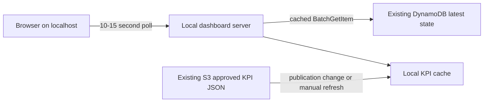

# Phase 1 realtime web dashboard

Status: **required Phase 1 deliverable; design approved; implementation and evidence not yet complete.** Phase 1 cannot be called a complete customer product until this dashboard passes G10. The default profile is local-first so it introduces no new fixed monthly AWS service charge.

## Product boundary

The dashboard gives an operator or customer a browser view of synthetic ESP health without requiring AWS Console access. It has two read models:

| View | Source | Refresh behavior |
|---|---|---|
| Live pump cards | Existing DynamoDB latest-state table via local API | Browser poll every 10–15 seconds; one shared server cache |
| Daily KPI and quality | Approved KPI JSON fetched from existing S3 data lake | Fetch only when publication ID changes or on explicit refresh |

“Realtime” means near-real-time observation of the latest state after a successful poll. It does not imply browser access to Kinesis, push delivery, zero latency or operational control. The page always shows `Synthetic data`, `Local demo`, `Last refreshed`, `Data age`, and the published batch run ID.

## Required Phase 1 architecture: local profile

The dashboard server runs from the repository and binds to `127.0.0.1` by default. It uses the operator's selected AWS profile/region through the server-side SDK credential chain. No credential, signed request capability, table name, bucket name or AWS Console link is embedded in frontend code.

The server reads the three known ESP keys with a batched operation and caches the response for the configured polling interval. Multiple browser tabs share the server cache. The server must not scan the table. KPI JSON is downloaded once per published version, validated and cached locally. Athena is not called from the browser or polling loop.

Stopping the local process removes the dashboard runtime. No CloudFront distribution, API Gateway, Cognito pool, dashboard Lambda, container, VM or web-assets bucket exists in the required profile.

## API contract

Expose these loopback-only, read-only endpoints:

| Endpoint | Response | Source |
|---|---|---|
| `GET /api/v1/pumps` | Allowed latest fields for all registered demo pumps | Cached DynamoDB batch read |
| `GET /api/v1/pumps/{esp_id}` | Allowed latest fields for one registered pump | Same cache |
| `GET /api/v1/kpis/latest` | Published daily KPI/quality summary and run metadata | Validated local KPI cache |
| `GET /api/v1/health` | App version, mode and dependency freshness only | Local process |

The response allow list is: `esp_id`, `timestamp`, `status`, `scenario`, `flow_rate`, `motor_temperature`, `motor_current`, `vibration`, `severity`, `finding`, `data_age_seconds`, `published_run_id`, and `published_at`. M2 must make numeric values typed and state updates monotonic before live release.

Reject unknown pump IDs, unsupported parameters and non-loopback access. Never return raw records, Kinesis sequence numbers, failure payloads, CloudFormation outputs, account identifiers, arbitrary S3 keys, arbitrary Athena SQL, environment variables, credentials or exception stacks.

## Frontend behavior

The responsive single page contains three pump cards, latest status/severity, signal values, observation time/data age, daily KPI trend, data-quality state and published run ID. Fixture mode enables offline UI development and deterministic screenshots before AWS integration.

Only one request can be in flight per browser. On an API failure, keep the last values with an explicit `stale` banner and last-success timestamp. After the configured stale threshold, show `unavailable`. Do not display stale values as live, infer missing samples as zero, or render unbounded raw-event charts.

## Cost controls

The required dashboard creates no new deployed AWS resource and no new fixed dashboard subscription. Incremental DynamoDB reads, S3 requests and transfer can still be billed; this is not a guaranteed $0 AWS bill.

Controls:

- One server cache shared by all local tabs; minimum poll interval 10 seconds.
- `BatchGetItem` for configured ESP IDs; no table scan.
- KPI fetch on publication version change or explicit refresh; no S3 LIST polling.
- No Athena query per refresh.
- No QuickSight, SPICE, WebSocket, custom dashboard metric, provisioned concurrency or always-on compute.
- Process runs only during a demo and exposes local health/counter evidence before stopping.

A 60-minute rehearsal records browser polls, cache hits/misses, DynamoDB operations/capacity, S3 GETs/bytes, API latency, end-to-end freshness and eventually available billing. An unavailable bill is recorded as unavailable, not zero.

## Optional hosted profile

An external customer URL is optional and outside the Phase 1 pass requirement. When explicitly needed, deploy a separate stack containing CloudFront, a separate private S3 web-assets bucket with Origin Access Control, API Gateway HTTP API, Cognito JWT authorization and a read-only Dashboard Lambda. It reuses the existing latest-state table and approved KPI object.

The optional stack has independent deploy/destroy commands, permissions, evidence and cost accounting. It is excluded from the parked baseline and destroyed after the sharing window. CloudFront uses Origin Access Control so the web-assets bucket remains private. [CloudFront OAC guidance](https://docs.aws.amazon.com/AmazonCloudFront/latest/DeveloperGuide/GettingStarted.SimpleDistribution.html), [API Gateway pricing](https://aws.amazon.com/api-gateway/pricing/), [CloudFront pricing](https://aws.amazon.com/cloudfront/pricing/), [Cognito pricing](https://aws.amazon.com/cognito/pricing/).

## Delivery sequence

1. Alongside M1: build responsive UI shell, fixture mode and response schema.
2. After M2: connect local API to monotonic DynamoDB latest state and verify stale/error behavior.
3. After M3: publish and consume versioned approved KPI JSON.
4. After M4: complete permission, failure, cleanup and usage evidence.
5. M5: run two complete customer rehearsals and publish redacted screenshots/recording.

## G10 acceptance evidence

1. One command starts the server on `127.0.0.1`; one command/check stops it cleanly.
2. A non-loopback request is rejected and no AWS credential appears in browser assets or API responses.
3. The API returns only allow-listed fields and rejects unknown pump IDs/parameters.
4. Normal and low-flow scenarios appear within the measured freshness target.
5. Forced DynamoDB/S3 failures show stale then unavailable state without crashing the UI.
6. Dashboard latest state and published KPI run ID match independently verified AWS evidence.
7. A 60-minute run records cache/request/latency/freshness and incremental cost evidence.
8. A clean machine can recreate the dashboard from lockfiles and fixture mode before AWS access.

Store private evidence under `evidence/runs/`. Publish only redacted screenshots and recordings. Dashboard completion does not replace M1–M4 data correctness, recovery or lifecycle gates.
